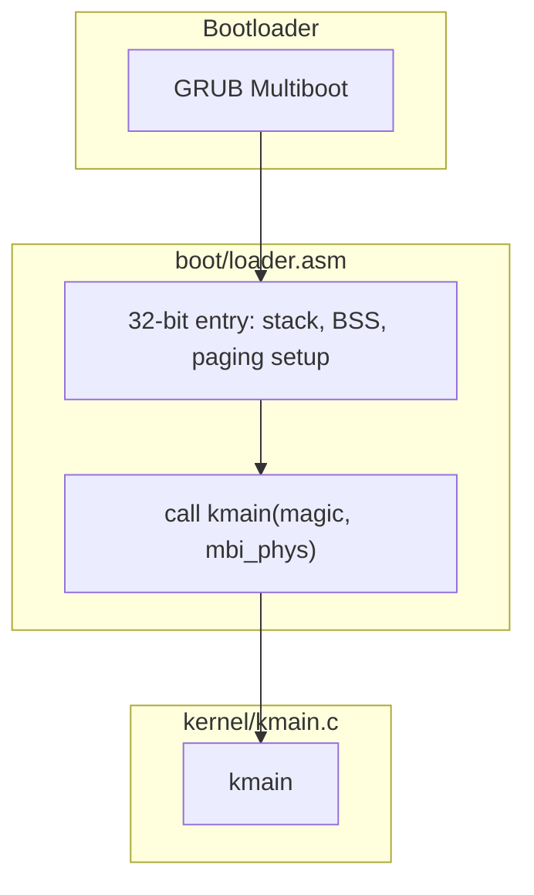
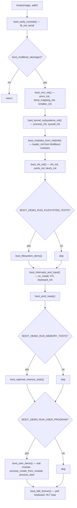
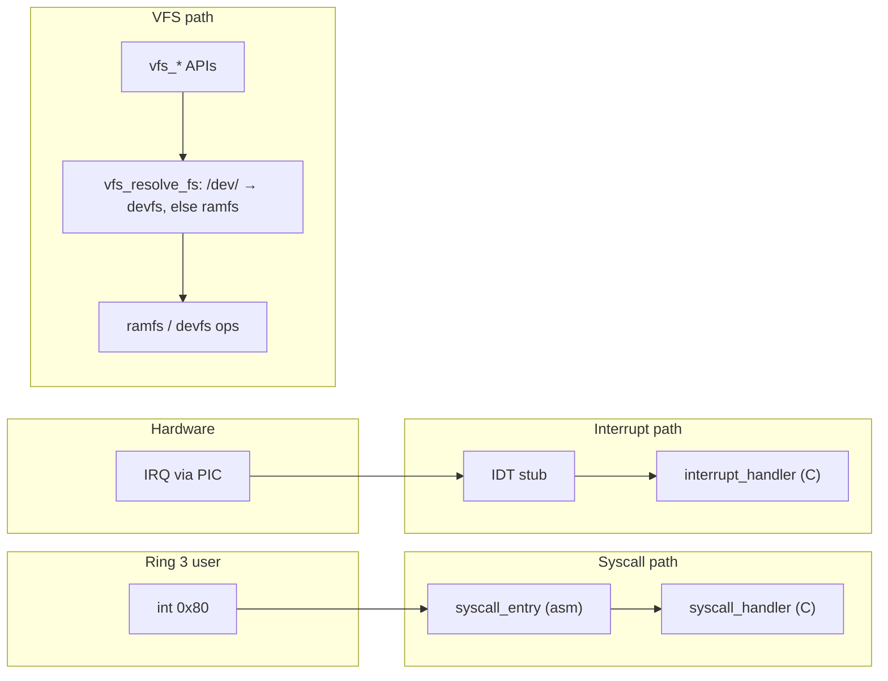

# MatrixOS — overall flow (reference)

This document captures the **main control flow** of the teaching kernel: from GRUB to `kmain`, through staged `boot_*` helpers in `kernel/boot.c`, then runtime entry paths. Source of truth for ordering: **`kernel/kmain.c`**, **`kernel/boot.c`**, **`boot/loader.asm`**.

Diagrams use [Mermaid](https://mermaid.js.org/). They render on GitHub and in many Markdown preview tools.

---

## 1. Boot chain (firmware → kernel entry)

GRUB loads the kernel as a **Multiboot** image. The assembly entry in `boot/loader.asm` sets up a minimal 32-bit environment (stack, BSS, higher-half mapping as implemented there), then calls **`kmain(uint32_t magic, uint32_t addr)`** with the Multiboot magic and **physical** pointer to the Multiboot information structure.

---

## 2. `kmain` orchestration (stages and optional demos)

`kmain` only **sequences** calls; each step is implemented in **`kernel/boot.c`**. Optional steps are gated by macros in **`include/boot_config.h`** (e.g. `BOOT_DEMO_RUN_FILESYSTEM_TESTS`, `BOOT_DEMO_RUN_MEMORY_TESTS`, `BOOT_DEMO_RUN_USER_PROGRAM`).

**Notes**

- **Memory first:** PMM → temp mapping → `kmalloc`, so later VFS and PCB allocations can succeed.
- **Modules before RAMFS:** `loader_init` records GRUB modules; **RAMFS** exposes them as read-only files (names must match `BOOT_DEMO_USER_MODULE_NAME*` where demos expect them).
- **Interrupts:** `isr_install` then **`sti`**; keyboard IRQ can fill the ring buffer consumed by **`SYSCALL_GETC`** in user mode.
- **User demo:** builds an address space, copies the module image, then **`process_start`** returns to user via **IRET**; user code uses **`int 0x80`** for syscalls.
- **Always ends** in **`boot_idle_forever`** so the CPU does not fall off the end of `kmain`.

---

## 3. Runtime request paths (after `sti`)

Three common ways control enters kernel code paths besides the boot sequence:

---

## 4. One-paragraph summary

**GRUB** hands off to **`boot/loader.asm`**, which calls **`kmain`**. **`kmain`** runs staged **`boot_*`** functions: console, Multiboot check, physical memory and heap, process and syscall setup, **Multiboot module** registration, **VFS** (RAMFS + devfs), optional filesystem self-tests, **IDT + PIC + keyboard**, optional memory tests, optional **user process** from a named module, then an **idle loop** with **HLT**. At runtime, **syscalls** use **`int 0x80`**, hardware uses **IRQs** through the **IDT**, and files go through **VFS** into **RAMFS** or **devfs** depending on path prefix.
