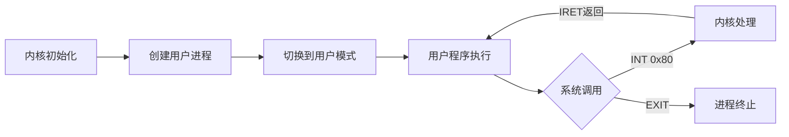

# 操作系统开发总结

## &#x20;简介

本文是编写自己的x86操作系统的实用指南。它旨在提供足够的技术细节帮助，同时不过多展示示例和代码片段。我们尝试收集了大量可用材料（通常都很优秀）和教程，无论是网上的还是其他地方的，并加入了我们自己遇到的问题和解决方法的见解。

作者作为一名有4年经验的代码工作者，似乎之前的工作总是作流程性的编码工作，处理的业务问题多，性能少，自从学习到了GNU作者Richard Stallman的精神，我决定要总结一下自己的知识，设计一个Matrix OS，并实现它，而且能够稳定运行。本文非自己创新之作，乃看着车子作轮子的拙作，如果有朋友需要借鉴，自无不可。

操作系统是一组主管并控制计算机操作、运用和运行硬件、软件资源和提供公共服务来组织用户交互的相互关联的系统软件程序，同时也是计算机系统的内核与基石。本系统主要实现操作系统关于进程管理，内存管理，文件系统管理，输入输出管理。

## 安装部署

本文基于Ubuntu 24.04.2 LTS 去运行，基于GNU相关软件编写。

调试采用QEMU+GDB,读者也可以采用自己喜欢的方式去作，不做限制。

## 系统架构概览

### **分层架构设计**

1.  **硬件抽象层** - 中断处理、内存管理、设备驱动
2.  **内核核心层** - 进程管理、文件系统、系统调用
3.  **用户空间层** - 用户程序运行环境

## 核心功能模块

### **1. 内存管理子系统**

*   **伙伴系统分配器** (`pmm.c`)

    *   支持最大 8MB 的内存块分配
    *   按 2 的幂次方进行块分裂与合并
    *   位图管理和空闲链表优化
*   **内核堆分配器** (`kmalloc.c`)

    *   首次适应算法 + 最佳适应优化
    *   支持 `kmalloc/kfree/kcalloc/krealloc`
    *   内存块分裂与合并机制
*   **虚拟内存管理** (`vmm.c`)

    *   用户空间页目录创建与管理
    *   用户程序加载与地址空间设置
    *   代码段(0x00000000)和栈段(0xBFFFF000)映射
*   **临时映射框架** (`temp_mapping.c`)

    *   4个固定虚拟地址槽用于快速物理页访问
    *   引用计数和自动清理机制

### **2. 进程管理**

*   **进程控制块** (`process.h`)

    *   PID 管理、状态机(就绪/运行/终止)
    *   独立的页目录和内核栈
    *   用户栈管理(0xBFFFFFFB)
*   **用户模式切换** (`switch.asm`)

    *   通过 IRET 指令实现特权级切换
    *   用户段选择子(0x1B代码段, 0x23数据段)
    *   完整的寄存器保存与恢复

### **3. 文件系统架构**

*   **虚拟文件系统层** (`vfs.c`)

    *   统一文件操作接口(open/read/write/close/seek/ioctl/stat)
    *   文件描述符管理(32个打开文件)
    *   标准输入输出(0,1,2)重定向
*   **RAM文件系统** (`ramfs.c`)

    *   将 GRUB 模块注册为只读文件
    *   支持最大64个文件，基于内存的存储
    *   文件权限管理(0444只读模式)
*   **设备文件系统** (`devfs.c`)

    *   `/dev/console` - 控制台输入输出
    *   `/dev/null` - 空设备
    *   `/dev/zero` - 零设备

### **4. 中断与系统调用**

*   **完整的中断处理框架**

    *   256个IDT条目，支持异常和硬件中断
    *   PIC控制器重映射(0x20-0x2F)
    *   键盘中断处理(IRQ1)
*   **系统调用接口** (`syscall.c`)

    *   INT 0x80软中断，DPL=3用户可访问
    *   支持进程控制、I/O操作、文件系统调用
    *   完整的寄存器上下文保存

### **5. 设备驱动**

*   **帧缓冲区驱动** (`fb.c`)

    *   VGA文本模式(80x25)，支持颜色控制
    *   硬件光标控制，屏幕滚动
    *   特殊字符处理(换行、退格、制表符)
*   **串口驱动** (`serial.c`)

    *   COM1端口(0x3F8)，支持格式化输出
    *   类似printf的`serial_printf`函数
    *   日志级别控制(DEBUG/INFO/ERROR)
*   **键盘驱动** (`keyboard.c`)

    *   PS/2键盘扫描码处理
    *   环形输入缓冲区(256字节)
    *   字符映射和修饰键处理

## 关键技术特性

### **高级内存管理**

```c
// 多级内存分配策略
物理页分配 → 伙伴系统(pmm_alloc_pages)
内核堆分配 → kmalloc/kfree  
用户空间 → vmm_create_user_space
临时访问 → temp_map_page
```

### **完整的进程隔离**

*   每个进程独立的页目录
*   用户态与内核态完全分离
*   系统调用作为唯一入口点

### **模块化文件系统**

    VFS (统一接口)
      ├── RAMFS (内存文件，只读)
      └── DEVFS (设备文件，读写)

### **健壮的错误处理**

*   系统调用错误码(ENOENT/EACCES/EMFILE等)
*   内存分配失败检测
*   中断处理安全机制

## 用户程序支持

### **系统调用API**

    ; 用户程序示例
    mov eax, SYS_PUTS    ; 系统调用号
    mov ebx, message     ; 参数
    int 0x80             ; 触发系统调用

### **多程序加载**

*   通过GRUB模块机制加载用户程序
*   支持同时加载多个用户程序
*   文件系统集成(程序作为文件访问)

## 帧缓冲区驱动 (fb.c)

### **核心功能**

**VGA文本模式显示控制器**，提供屏幕字符输出能力

### **技术特性**

#### **内存映射**

```c
static char *fb = (char *)0xC00B8000;  // VGA文本缓冲区物理地址映射
```

*   **双字节单元格结构**: `[字符ASCII][属性字节]`
*   **属性字节格式**: `[背景色4位][前景色4位]`
*   **80×25分辨率**: 2000个字符容量

#### **颜色系统**

```c
#define FB_BLACK         0x0
#define FB_BLUE          0x1
#define FB_WHITE         0xF
// 共16种标准VGA颜色
```

*   **前景色** (低4位): 字符颜色
*   **背景色** (高4位): 单元格背景色

### **核心API**

#### **基础写入**

```c
int fb_write(char *buf, uint32_t len);  // 核心写入函数
void fb_putchar(char c);               // 单字符输出
void fb_puts(char *str);               // 字符串输出
```

#### **光标控制**

```c
void fb_set_cursor(uint32_t position);  // 设置光标位置
uint32_t fb_get_cursor(void);          // 获取光标位置
void fb_move_cursor(int32_t offset);   // 相对移动光标
```

#### **屏幕管理**

    void fb_clear(void);                   // 清屏
    void fb_clear_line(uint32_t line);     // 清空单行
    void fb_scroll(void);                  // 屏幕滚动

#### **颜色控制**

```c
void fb_set_color(uint8_t foreground, uint8_t background);
void fb_get_color(uint8_t *foreground, uint8_t *background);
```

### **特殊字符处理**

```c
case '\n':  // 换行
    cursor_pos = (cursor_pos + 80) / 80 * 80;
    break;
case '\t':  // 制表符(4空格)
    for (int j = 0; j < 4; j++) fb_putchar(' ');
    break;  
case '\b':  // 退格
    if (cursor_pos > 0) cursor_pos--;
    break;
case '\r':  // 回车
    cursor_pos = cursor_pos / 80 * 80;
    break;
```

### **硬件光标控制**

```c
; 通过I/O端口控制硬件光标
outb(0x3D4, 0x0F);        // 选择光标低字节寄存器
outb(0x3D5, position & 0xFF);
outb(0x3D4, 0x0E);        // 选择光标高字节寄存器  
outb(0x3D5, (position >> 8) & 0xFF);
```

## 串口驱动 (serial.c)

### **核心功能**

**串行通信控制器**，提供调试输出和系统日志功能

### **技术规格**

*   **端口**: COM1 (0x3F8)
*   **波特率**: 115200 (除数为1)
*   **数据格式**: 8数据位，无奇偶校验，1停止位

### **初始化配置**

```c
void serial_init(uint16_t port, uint16_t divisor) {
    outb(port + 1, 0x00);        // 禁用中断
    outb(port + 3, 0x80);        // 启用DLAB(设置波特率)
    outb(port + 0, divisor & 0xFF);     // 波特率低位
    outb(port + 1, (divisor >> 8) & 0xFF); // 波特率高位
    outb(port + 3, 0x03);        // 8位数据，无奇偶校验，1停止位
    outb(port + 2, 0xC7);        // 启用FIFO，14字节阈值
    outb(port + 4, 0x03);        // 启用RTS和DTR
}
```

### **核心API**

#### **基础I/O**

```c
void serial_write_char(uint16_t port, char c);  // 单字符输出
void serial_write(uint16_t port, const char* str); // 字符串输出
int serial_transmit_empty(uint16_t port);       // 发送缓冲区空检查
```

#### **高级格式化输出**

```c
void serial_printf(uint16_t port, const char* format, ...);  // 格式化输出
void serial_vprintf(uint16_t port, const char* format, va_list args); // 可变参数处理
```

#### **日志系统**

```c
typedef enum { DEBUG, INFO, ERROR } log_level_t;
void serial_log(uint16_t port, log_level_t level, const char* format, ...);
```

输出示例: `[INFO] Process 1 started`

### **格式化支持**

支持完整的printf风格格式化：

*   `%d` - 十进制整数
*   `%x` - 十六进制整数
*   `%s` - 字符串
*   `%c` - 字符
*   `%p` - 指针地址
*   `%%` - 百分号转义

### **内部实现细节**

#### **数字转换算法**

```c
// 十进制转换
static void itoa_dec(int num, char* str);
// 十六进制转换  
static void itoa_hex(uint32_t num, char* str);
```

#### **发送流控制**

```c
void serial_write_char(uint16_t port, char c) {
    while (!serial_transmit_empty(port));  // 等待发送缓冲区空
    outb(port, c);                         // 发送字符
}
```

***

## &#x20;分段

### **GDT全局描述符表结构**

    gdt_start:
        ; 索引0: 空描述符 (强制要求)
        dq 0x0000000000000000

        ; 索引1: 内核代码段 (选择子 0x08)
    gdt_code:
        dw 0xFFFF                 ; Limit 0-15
        dw 0x0000                 ; Base 0-15  
        db 0x00                   ; Base 16-23
        db 10011010b              ; P=1, DPL=0, S=1, Type=1010 (只执行)
        db 11001111b              ; G=1, D/B=1, L=0, Limit 16-19=1111
        db 0x00                   ; Base 24-31

        ; 索引2: 内核数据段 (选择子 0x10)
    gdt_data:
        dw 0xFFFF                 ; Limit 0-15
        dw 0x0000                 ; Base 0-15
        db 0x00                   ; Base 16-23
        db 10010010b              ; P=1, DPL=0, S=1, Type=0010 (读写)
        db 11001111b              ; G=1, D/B=1, L=0, Limit 16-19=1111
        db 0x00                   ; Base 24-31

        ; 索引3: 用户代码段 (选择子 0x18)
    gdt_user_code:
        dw 0xFFFF                 ; Limit 0-15
        dw 0x0000                 ; Base 0-15
        db 0x00                   ; Base 16-23
        db 11111010b              ; P=1, DPL=3, S=1, Type=1010 (只执行)
        db 11001111b              ; G=1, D/B=1, L=0, Limit 16-19=1111
        db 0x00                   ; Base 24-31

        ; 索引4: 用户数据段 (选择子 0x20)  
    gdt_user_data:
        dw 0xFFFF                 ; Limit 0-15
        dw 0x0000                 ; Base 0-15
        db 0x00                   ; Base 16-23
        db 11110010b              ; P=1, DPL=3, S=1, Type=0010 (读写)
        db 11001111b              ; G=1, D/B=1, L=0, Limit 16-19=1111
        db 0x00                   ; Base 24-31

        ; 索引5: TSS段 (选择子 0x28)
    gdt_tss:
        dw 104                    ; Limit (TSS结构大小)
        dw 0                      ; Base 0-15 (运行时设置)
        db 0                      ; Base 16-23 (运行时设置)
        db 10001001b              ; P=1, DPL=0, Type=1001 (32位TSS)
        db 00000000b              ; G=0, AVL=0, Limit 16-19=0000
        db 0                      ; Base 24-31 (运行时设置)

### 设计特点总结

#### **1. 平坦内存模型**

*   所有段基地址=0，界限=4GB
*   实际内存保护通过分页机制实现
*   分段主要用于特权级控制

#### **2. 四级特权架构**

    Ring 0: 内核代码/数据段 (最高特权)
    Ring 3: 用户代码/数据段 (最低特权)

#### **3. 对称段设计**

*   内核和用户段使用相同的段属性(除了DPL)
*   简化段切换逻辑
*   统一的编程模型

#### **4. TSS集成**

*   为任务切换提供硬件支持
*   存储任务状态和内核栈指针
*   特权级切换时自动更新栈

#### **5. 系统调用门**

*   专门的调用门(INT 0x80)用于用户-内核切换
*   DPL=3允许用户程序调用
*   提供受控的内核入口点

这种分段设计体现了x86保护模式的经典用法：**主要依赖分页进行内存管理，使用分段实现特权级隔离**，为操作系统提供了坚实的内存保护基础。

## 中断处理系统

### **中断架构总览**

#### **IDT中断描述符表**

```c
struct idt_entry {
    uint16_t base_low;     // 处理程序地址低16位
    uint16_t sel;          // 代码段选择子(KERNEL_CS=0x08)
    uint8_t  zero;         // 保留
    uint8_t  flags;        // 类型属性
    uint16_t base_high;    // 处理程序地址高16位
};
```

#### **中断类型分布**

| 中断号   | 类型   | 用途      | 标志位               |
| :---- | :--- | :------ | :---------------- |
| 0-31  | 异常   | CPU异常处理 | 0x8E (中断门)        |
| 32-47 | IRQ  | 硬件中断    | 0x8E (中断门)        |
| 0x80  | 系统调用 | 用户态系统调用 | 0xEE (陷阱门, DPL=3) |

### **中断处理流程**

#### **1. 中断桩生成 (interrupt\_asm.s)**

    ; 无错误码中断模板
    %macro ISR_NOERR 1
    global int_%1
    int_%1:
        push %1          ; 压入中断号
        push 0           ; 压入伪错误码
        jmp isr_common_stub
    %endmacro

    ; 有错误码中断模板  
    %macro ISR_ERR 1
    global int_%1
    int_%1:
        ; 错误码已由CPU压入
        push %1          ; 压入中断号
        jmp isr_common_stub
    %endmacro

#### **2. 公共中断桩**

    isr_common_stub:
        pusha                    ; 保存所有通用寄存器
        mov ax, ds
        push eax                 ; 保存原数据段
        
        ; 切换到内核数据段
        mov ax, 0x10
        mov ds, ax
        mov es, ax
        mov fs, ax
        mov gs, ax
        
        ; 调用C中断处理程序
        push dword [esp + 40]    ; 中断号参数
        lea eax, [esp + 44]      ; 寄存器结构指针
        push eax
        call interrupt_handler
        
        ; 恢复环境
        pop eax
        mov ds, ax
        mov es, ax
        mov fs, ax
        mov gs, ax
        popa
        
        add esp, 8              ; 清理中断号和错误码
        sti                     ; 重新启用中断
        iret

#### **3. C语言中断分发**

```c
void interrupt_handler(void* regs, uint32_t int_no) {
    serial_printf(COM1, "ISR: %x\n", int_no);
    
    if (int_no == 33) {  // 键盘中断(IRQ1)
        uint8_t sc = inb(KEYBOARD_PORT);
        keyboard_input_handler(sc);
    }
    // 其他中断处理...
}
```

### **PIC可编程中断控制器**

#### **PIC重映射**

```c
void pic_remap(int offset1, int offset2) {
    // 主PIC: 0x20-0x27 (IRQ0-7)
    // 从PIC: 0x28-0x2F (IRQ8-15)
    outb(0x20, 0x11);  // ICW1: 边沿触发, 级联, 需要ICW4
    outb(0xA0, 0x11);
    
    outb(0x21, 0x20);  // ICW2: 主PIC向量偏移
    outb(0xA1, 0x28);  // ICW2: 从PIC向量偏移
    
    outb(0x21, 0x04);  // ICW3: 主片IR2连接从片
    outb(0xA1, 0x02);  // ICW3: 从片连接到主片IR2
    
    outb(0x21, 0x01);  // ICW4: 8086模式
    outb(0xA1, 0x01);
}
```

#### **中断结束信号(EOI)**

```c
void pic_eoi(uint8_t irq) {
    if (irq >= 8) {
        outb(PIC2_CMD, 0x20);  // 从PIC EOI
    }
    outb(PIC1_CMD, 0x20);      // 主PIC EOI
}
```

## 输入系统 - 键盘驱动

### **键盘架构设计**

#### **环形输入缓冲区**

```c
#define KBUF_SIZE 256
static char kbuf[KBUF_SIZE];  // 字符缓冲区
static int khead = 0;         // 写入位置
static int ktail = 0;         // 读取位置
```

### **键盘初始化流程**

```c
void keyboard_init() {
    outb(0x64, 0xAD);     // 禁用键盘
    outb(0x64, 0xA7);     // 禁用辅助设备
    
    // 清空输出缓冲区
    while (inb(0x64) & 0x01) {
        inb(0x60);
    }
    
    outb(0x64, 0xAE);     // 启用键盘
    outb(0x60, 0xF4);     // 启用扫描
}
```

### **扫描码处理核心**

#### **扫描码到ASCII转换**

```c
char scancode_to_char(uint8_t sc) {
    // 释放事件处理(最高位为1)
    if (sc & 0x80) {
        return 0;
    }
    
    // 特殊键处理
    switch (sc) {
        case 0x0E: return '\b';  // Backspace
        case 0x1C: return '\n';  // Enter
        default: break;
    }
    
    // 普通键映射
    if (sc >= 128) return 0;
    return normal_map[sc];
}
```

#### **标准键盘映射表**

```c
const char normal_map[128] = {
    0,    0,    '1',  '2',  '3',  '4',  '5',  '6',  '7',  '8', 
    '9',  '0',  '-',  '=',  '\b', '\t', 'q',  'w',  'e',  'r',
    't',  'y',  'u',  'i',  'o',  'p',  '[',  ']',  '\n', 0,
    'a',  's',  'd',  'f',  'g',  'h',  'j',  'k',  'l',  ';',
    '\'', '`',  0,    '\\', 'z',  'x',  'c',  'v',  'b',  'n',
    'm',  ',',  '.',  '/',  0,    '*',  0,    ' ',  // ... 剩余映射
};
```

### **中断处理流水线**

#### **1. 键盘中断处理**

```c
void keyboard_input_handler(uint8_t sc) {
    // 过滤键盘响应(非按键数据)
    if (sc == 0xFA || sc == 0xAA || sc == 0x00 || sc == 0xFF) {
        pic_eoi(1);
        return;
    }
    
    // 转换为字符并存入缓冲区
    char c = scancode_to_char(sc);
    if (c != 0) {
        kbuf[khead] = c;
        khead = (khead + 1) % KBUF_SIZE;
    }
    
    pic_eoi(1);  // 发送EOI
}
```

#### **2. 字符读取接口**

```c
char keyboard_get_char(void) {
    if (khead == ktail) return 0;  // 缓冲区空
    
    char c = kbuf[ktail];
    ktail = (ktail + 1) % KBUF_SIZE;
    return c;
}
```

### **系统调用集成**

#### **用户输入系统调用**

```c
case SYSCALL_GETC:  // 系统调用号3
    char c = keyboard_get_char();
    if (c) {
        serial_printf(COM1, "SYSCALL: Process %d read char '%c'\n", pid, c);
        r->eax = (uint32_t)c;  // 通过eax返回值
    } else {
        r->eax = 0;  // 没有输入
    }
    break;
```

### 中断-输入协同工作流

#### **完整事件链**

    硬件中断 → PIC → IDT → 中断桩 → C处理程序 → 键盘驱动 → 缓冲区 → 系统调用 → 用户程序

#### **具体执行流程**

1.  **按键按下** → 键盘控制器产生扫描码
2.  **PIC转发** → IRQ1中断信号到CPU
3.  **IDT路由** → 跳转到int\_33中断桩
4.  **上下文保存** → 保存所有寄存器状态
5.  **C处理程序** → keyboard\_input\_handler处理扫描码
6.  **字符转换** → scancode\_to\_char转换为ASCII
7.  **缓冲存储** → 存入环形缓冲区kbuf
8.  **EOI信号** → 通知PIC中断处理完成
9.  **用户读取** → 通过SYSCALL\_GETC系统调用获取字符

## 内存管理

### **四级分层设计**

    用户程序 → 虚拟内存管理 → 内核堆分配 → 物理页管理 → 临时映射框架
        ↓           ↓           ↓           ↓           ↓
      VMM         VMM        KMalloc      PMM       Temp Mapping

### &#x20;分页管理系统

#### **地址空间布局**

| 虚拟地址范围                    | 用途          | 物理映射 |
| :------------------------ | :---------- | :--- |
| `0x00000000 - 0x003FFFFF` | 用户代码区 (4MB) | 动态分配 |
| `0xBFFFF000 - 0xBFFFFFFF` | 用户栈区 (4KB)  | 动态分配 |
| `0xC0000000 - 0xC00AFFFF` | 内核代码和数据     | 固定映射 |
| `0xC00B8000 - 0xC00B8FFF` | VGA帧缓冲区     | 直接映射 |
| `0xC03FF000 - 0xC03FFFFF` | 临时映射区 (4槽)  | 动态映射 |
| `0xFFC00000 - 0xFFFFFFFF` | 页表自映射区      | 页表自身 |

#### **页表管理机制**

##### **内核页表初始化**

    ; 身份映射：物理地址 = 虚拟地址
    mov edi, first_page_table
    mov ebx, 0x00000000
    mov ecx, 1024 * 33  ; 33个页表，覆盖128MB
    .fill_identity:
        mov eax, ebx
        or eax, 0x03    ; Present + Writable
        mov [edi], eax
        add edi, 4
        add ebx, 0x1000
        loop .fill_identity

    ; 高半内核映射：物理地址 + 0xC0000000
    mov edi, page_directory
    mov esi, first_page_table  
    mov ebx, 768        ; 页目录索引768 → 虚拟地址0xC0000000

##### **页目录自映射**

    ; 0xFFC00000访问页目录自身
    mov eax, page_directory
    or eax, 0x03
    mov [page_directory + 1023*4], eax

#### **用户地址空间管理**

##### **用户页目录创建**

```c
uint32_t vmm_create_user_space(void) {
    uint32_t user_page_dir = pmm_alloc_pages(0);
    // 复制内核映射(768-1023项)，保持内核可见
    for (int i = 768; i < 1024; i++) {
        page_dir[i] = kernel_page_dir[i];
    }
    return user_page_dir;
}
```

##### **用户程序加载**

```c
int vmm_load_user_program(uint32_t page_dir, uint32_t binary_phys, uint32_t size) {
    // 代码映射：虚拟地址0x00000000
    page_dir_ptr[0] = code_page_table | 0x07;  // User+RW+Present
    code_table[0] = user_code_page | 0x07;
    
    // 栈映射：虚拟地址0xBFFFF000  
    page_dir_ptr[0x3FE] = stack_page_table | 0x07;    // 页目录项1022
    stack_table[0x3FF] = user_stack_page | 0x07;      // 页表项1023
    
    // 复制程序代码到用户空间
    memcpy((void*)temp_dst, (void*)temp_src, size);
}
```

#### **临时映射框架**

##### **固定映射槽设计**

```c
#define TEMP_MAPPING_ADDR 0xC03FF000
#define TEMP_MAPPING_COUNT 4

// 虚拟地址分配：
// 槽0: 0xC03FF000, 槽1: 0xC03FE000  
// 槽2: 0xC03FD000, 槽3: 0xC03FC000
```

##### **动态映射管理**

```c
uint32_t temp_map_page(uint32_t physical_addr) {
    // 查找可用槽，映射物理页到固定虚拟地址
    uint32_t virtual_addr = TEMP_MAPPING_ADDR - (slot * PAGE_SIZE);
    map_page(virtual_addr, physical_addr, 0x03);  // Present+Writable
    return virtual_addr;
}
```

### &#x20;物理内存管理

#### **伙伴系统分配器**

##### **核心数据结构**

```c
#define MAX_ORDER 11  // 最大块：2^11页 = 2048页 = 8MB

struct buddy_system {
    spinlock_t lock;
    uint32_t total_pages;
    struct free_area free_area[MAX_ORDER + 1];
    uint8_t* bitmap;  // 页使用状态位图
};
```

##### **分配算法**

```c
uint32_t pmm_alloc_pages(uint32_t order) {
    // 1. 查找合适阶数的空闲块
    for (current_order = order; current_order <= MAX_ORDER; current_order++) {
        if (!list_empty(&area->free_list)) break;
    }
    
    // 2. 如果块太大，进行分裂
    while (current_order > order) {
        current_order--;
        // 分裂块，将伙伴加入相应链表
        uint32_t buddy_addr = page_addr ^ (1 << (current_order + 12));
        list_add(&buddy->list, &area->free_list);
    }
    
    return page_addr;
}
```

##### **释放与合并**

```c
void pmm_free_pages(uint32_t page_addr, uint32_t order) {
    // 尝试合并伙伴块
    while (current_order < MAX_ORDER) {
        uint32_t buddy_idx = find_buddy_pfn(page_idx, current_order);
        // 检查伙伴是否存在且空闲
        if (buddy_found) {
            // 合并块
            list_del(&buddy_page->list);
            current_order++;
        } else {
            break;
        }
    }
}
```

### &#x20;内核堆管理

### **堆分配器设计**

##### **内存块结构**

```c
struct kmalloc_header {
    size_t size;                    // 块大小（含头部）
    uint8_t is_free;               // 空闲标志
    struct kmalloc_header* next;   // 下一个块
    struct kmalloc_header* prev;   // 前一个块
};
```

##### **分配策略**

```c
void* kmalloc(size_t size) {
    // 最佳适应算法
    while (current) {
        if (current->is_free && current->size >= actual_size) {
            if (!best_fit || current->size < best_fit->size) {
                best_fit = current;  // 找到最小合适块
            }
        }
        current = current->next;
    }
    
    // 块分裂：如果远大于需求
    if (best_fit->size >= actual_size + sizeof(...) + KMALLOC_MIN_SIZE) {
        // 创建新空闲块
        struct kmalloc_header* new_block = ...;
        new_block->size = best_fit->size - actual_size;
        new_block->is_free = 1;
    }
}
```

##### **释放与合并**

```c
void kfree(void* ptr) {
    header->is_free = 1;
    
    // 向后合并
    if (header->next && header->next->is_free) {
        header->size += header->next->size;
        header->next = header->next->next;
    }
    
    // 向前合并  
    if (header->prev && header->prev->is_free) {
        header->prev->size += header->size;
        header->prev->next = header->next;
    }
}
```

### &#x20;内存管理流程

#### **用户进程创建流程**

1.  **创建页目录** - `vmm_create_user_space()`
2.  **分配代码页** - `pmm_alloc_pages(0)` → 映射到 `0x00000000`
3.  **分配栈页** - `pmm_alloc_pages(0)` → 映射到 `0xBFFFF000`
4.  **加载程序** - 通过临时映射复制代码
5.  **切换CR3** - 激活用户地址空间

#### **内核分配流程**

1.  **小对象** - `kmalloc()` → 内核堆分配
2.  **大对象/页** - `pmm_alloc_pages()` → 伙伴系统
3.  **物理页访问** - `temp_map_page()` → 临时映射

### &#x20;设计亮点

#### **1. 多层次协作**

*   **伙伴系统**：大块物理页分配
*   **堆分配器**：小块内核对象分配
*   **临时映射**：物理页临时访问
*   **虚拟内存**：地址空间隔离

#### **2. 高效算法**

*   **伙伴系统**：O(1)分配，自动合并减少碎片
*   **最佳适应**：减少内部碎片，提高内存利用率
*   **临时映射**：固定地址避免TLB刷新开销

#### **3. 安全隔离**

*   **用户/内核分离**：不同页目录，特权级保护
*   **地址空间随机化**：用户代码固定但隔离
*   **内存保护**：只读代码页，读写数据页

#### **4. 性能优化**

*   **自映射页表**：通过`0xFFC00000`直接访问页表
*   **TLB控制**：`invlpg`指令精确刷新
*   **锁优化**：各层级独立锁，减少竞争

#### **5. 完整工具链**

```c
// 调试统计
void pmm_stats(void);      // 伙伴系统状态
void kmalloc_stats(void);  // 堆分配状态
// 测试框架
void run_all_memory_tests(void);  // 综合测试
```

### &#x20;内存统计示例

    PMM: Order 0 (1 pages): 15 free blocks
         Order 5 (32 pages): 2 free blocks  
    KMalloc: Used blocks: 45 (18240 bytes)
             Memory efficiency: 87%

这个内存管理系统体现了**现代操作系统内存管理的核心思想**：通过分页实现隔离，通过多级分配器平衡性能和碎片，通过虚拟化提供统一的访问接口，为系统提供了坚实的内存基础。

## &#x20;用户模式

### 用户模式架构总览

#### **特权级隔离设计**

    Ring 0 (内核模式) ↔ Ring 3 (用户模式)
         ↓                    ↓
    最高特权              最低特权
    全系统访问          受限系统访问
    直接硬件操作        通过系统调用

### &#x20;用户模式核心组件

#### **1. 段描述符配置**

##### **用户段定义**

    ; 用户代码段 (索引3, 选择子 0x18)
    gdt_user_code:
        dw 0xFFFF                 ; Limit
        dw 0x0000                 ; Base
        db 0x00                   ; Base
        db 11111010b              ; P=1, DPL=3, Type=1010 (只执行)
        db 11001111b              ; G=1, D/B=1
        db 0x00

    ; 用户数据段 (索引4, 选择子 0x20)  
    gdt_user_data:
        dw 0xFFFF
        dw 0x0000
        db 0x00
        db 11110010b              ; P=1, DPL=3, Type=0010 (读写)
        db 11001111b
        db 0x00

##### **关键属性**

*   **DPL=3**：用户特权级 (Ring 3)
*   **平坦模型**：基地址0，界限4GB
*   **类型限制**：代码段只执行，数据段读写

#### **2. 用户地址空间布局**

```c
#define USER_STACK_TOP 0xBFFFFFFB

用户虚拟地址空间：
0x00000000 - 0x003FFFFF: 用户代码区 (4MB)
0xBFFFF000 - 0xBFFFFFFF: 用户栈区 (4KB，栈顶0xBFFFFFFB)
```

#### **3. 进程控制块(PCB)**

```c
typedef struct process_control_block {
    uint32_t pid;
    process_state_t state;
    char name[32];
    uint32_t page_directory;  // 用户页目录物理地址
    uint32_t entry_point;     // 用户程序入口(0x00000000)
    uint32_t user_stack;      // 用户栈指针(USER_STACK_TOP)
    uint32_t kernel_stack;    // 内核栈(特权级切换时使用)
} pcb_t;
```

### 用户模式切换机制

#### **1. 用户进程创建流程**

##### **从GRUB模块创建进程**

```c
uint32_t process_create_from_module(const char* module_name) {
    // 1. 查找GRUB模块
    module_info_t* module = loader_find_module(module_name);
    
    // 2. 创建用户地址空间
    uint32_t user_page_dir = vmm_create_user_space();
    
    // 3. 加载用户程序
    vmm_load_user_program(user_page_dir, module->start, module->size);
    
    // 4. 分配内核栈
    uint32_t kernel_stack = pmm_alloc_pages(0);
    
    // 5. 初始化PCB
    pcb->page_directory = user_page_dir;
    pcb->entry_point = 0x00000000;      // 用户程序入口
    pcb->user_stack = USER_STACK_TOP;   // 用户栈顶
    pcb->kernel_stack = kernel_stack + PAGE_SIZE;
}
```

##### **用户程序加载细节**

```c
int vmm_load_user_program(uint32_t page_dir, uint32_t binary_phys, uint32_t size) {
    // 映射用户代码到 0x00000000
    page_dir_ptr[0] = code_page_table | 0x07;  // User+RW+Present
    code_table[0] = user_code_page | 0x07;
    
    // 映射用户栈到 0xBFFFF000
    page_dir_ptr[0x3FE] = stack_page_table | 0x07;
    stack_table[0x3FF] = user_stack_page | 0x07;
    
    // 通过临时映射复制程序代码
    uint32_t temp_dst = temp_map_page(user_code_page);
    uint32_t temp_src = temp_map_page(binary_phys);
    memcpy((void*)temp_dst, (void*)temp_src, size);
}
```

#### **2. 用户模式切换汇编**

##### **模式切换核心**

    ; void switch_to_user_mode(uint32_t page_dir, uint32_t entry, uint32_t stack)
    switch_to_user_mode:
        cli
        mov eax, [esp+4]   ; 页目录物理地址
        mov ebx, [esp+8]   ; 用户程序入口点
        mov ecx, [esp+12]  ; 用户栈顶地址

        ; 1. 切换到用户页目录
        mov cr3, eax

        ; 2. 设置用户数据段
        mov ax, 0x23       ; 用户数据段选择子
        mov ds, ax
        mov es, ax
        mov fs, ax
        mov gs, ax

        ; 3. 在栈上构造IRET帧
        push 0x23          ; SS (用户数据段)
        push ecx           ; ESP (用户栈指针)
        push 0x202         ; EFLAGS (IF=1 启用中断)
        push 0x1B          ; CS (用户代码段)
        push ebx           ; EIP (用户程序入口)

        ; 4. 通过IRET切换到用户模式
        iret

##### **IRET帧结构**

    栈顶 → [低地址]
    SS     (0x23)    用户数据段
    ESP    (0xBFFFFFFB) 用户栈指针
    EFLAGS (0x202)   中断启用标志
    CS     (0x1B)    用户代码段  
    EIP    (入口点)   用户程序入口
          [高地址]

用户模式现在几乎触手可及，只需几步即可实现。尽管这些步骤在本章中看起来很简单，但实现起来可能很棘手，因为有很多地方的小错误会导致难以发现的错误。



这个用户模式实现体现了**现代操作系统进程隔离的核心思想**，通过硬件特权级、虚拟内存和系统调用机制，为应用程序提供了安全、隔离的执行环境，同时保持了与内核的高效交互能力。

## 文件系统架构总览

### **三层抽象设计**

    用户程序 → 系统调用 → VFS虚拟文件系统 → 具体文件系统 → 存储后端
        ↓           ↓           ↓               ↓           ↓
      Syscall      VFS       RAMFS/DEVFS     RAM/Device   Memory/Hardware

### &#x20;VFS虚拟文件系统

#### **核心数据结构**

##### **统一文件操作接口**

```c
struct file_operations {
    int (*open)(const char* path, int flags);
    int (*close)(int fd);
    int (*read)(int fd, void* buf, uint32_t count);
    int (*write)(int fd, const void* buf, uint32_t count);
    int (*seek)(int fd, int offset, int whence);
    int (*ioctl)(int fd, int request, void* argp);
    int (*stat)(const char* path, struct file_stat* stat);
};
```

##### **文件描述符管理**

```c
#define MAX_OPEN_FILES 32
#define STDIN_FILENO  0
#define STDOUT_FILENO 1
#define STDERR_FILENO 2

struct file_handle {
    struct filesystem* fs;      // 所属文件系统
    void* private_data;         // 文件系统私有数据
    uint32_t pos;               // 文件位置
    uint32_t flags;             // 打开标志
    int ref_count;              // 引用计数
};
```

##### **文件状态信息**

```c
struct file_stat {
    uint32_t size;              // 文件大小
    uint32_t mode;              // 权限模式
    uint32_t type;              // 文件类型
    uint32_t inode;             // inode编号
};

// 文件类型定义
#define FT_UNKNOWN      0
#define FT_REGULAR      1       // 普通文件
#define FT_DIRECTORY    2       // 目录
#define FT_CHAR_DEVICE  3       // 字符设备
```

#### **VFS核心API**

##### **文件操作**

```c
int vfs_open(const char* path, int flags);
int vfs_close(int fd);
int vfs_read(int fd, void* buf, uint32_t count);
int vfs_write(int fd, const void* buf, uint32_t count);
int vfs_seek(int fd, int offset, int whence);
int vfs_ioctl(int fd, int request, void* argp);
int vfs_stat(const char* path, struct file_stat* stat);
```

##### **文件系统注册**

```c
int vfs_register_fs(const char* name, struct file_operations* ops);
```

#### **路径解析机制**

```c
static struct filesystem* vfs_resolve_fs(const char* path) {
    // 简单路径解析策略：
    // /dev/ 开头的路径 → devfs
    // 其他路径 → ramfs
    if (strncmp(path, "/dev/", 5) == 0) {
        return find_fs_by_name("devfs");
    } else {
        return find_fs_by_name("ramfs");
    }
}
```

### RAMFS内存文件系统

#### **核心设计**

##### **内存文件结构**

```c
#define MAX_RAMFS_FILES 64

struct ramfs_file {
    char name[MAX_PATH];        // 文件名
    uint8_t* data;              // 文件数据指针
    uint32_t size;              // 文件大小
    uint32_t mode;              // 权限模式 (0444只读)
    uint32_t type;              // 文件类型 (FT_REGULAR)
};
```

##### **打开文件上下文**

```c
struct ramfs_private {
    struct ramfs_file* file;    // 指向文件结构
    uint32_t pos;               // 当前文件位置
};
```

#### **RAMFS初始化**

```c
void ramfs_init(void) {
    // 从GRUB加载器注册所有模块为文件
    uint32_t mod_count = loader_get_module_count();
    for (uint32_t i = 0; i < mod_count; i++) {
        module_info_t* mod = loader_get_module(i);
        
        strncpy(files[file_count].name, mod->name, MAX_PATH-1);
        files[file_count].data = (uint8_t*)mod->start;  // 直接指向模块内存
        files[file_count].size = mod->size;
        files[file_count].mode = 0444;  // 只读权限
        files[file_count].type = FT_REGULAR;
        file_count++;
    }
    
    vfs_register_fs("ramfs", &ramfs_ops);
}
```

#### **文件操作实现**

##### **打开文件**

```c
int ramfs_open(const char* path, int flags) {
    struct ramfs_file* file = ramfs_find_file(path);
    if (!file) return ENOENT;  // 文件不存在
    
    // 权限检查：尝试写入只读文件
    if ((flags & O_WRONLY) && (file->mode & 0222) == 0) {
        return EACCES;
    }
    
    // 分配文件句柄
    int handle = find_free_handle();
    ramfs_handles[handle].file = file;
    ramfs_handles[handle].pos = 0;
    
    return handle;  // 返回文件描述符
}
```

##### **读取文件**

```c
int ramfs_read(int handle, void* buf, uint32_t count) {
    struct ramfs_private* priv = &ramfs_handles[handle];
    struct ramfs_file* file = priv->file;
    
    // 计算可读取的字节数
    uint32_t to_read = count;
    if (priv->pos + to_read > file->size) {
        to_read = file->size - priv->pos;
    }
    
    // 内存拷贝读取
    memcpy(buf, file->data + priv->pos, to_read);
    priv->pos += to_read;
    
    return to_read;  // 返回实际读取字节数
}
```

##### **文件状态查询**

    int ramfs_stat(const char* path, struct file_stat* stat) {
        struct ramfs_file* file = ramfs_find_file(path);
        if (!file) return ENOENT;
        
        stat->size = file->size;
        stat->mode = file->mode;
        stat->type = file->type;
        stat->inode = (uint32_t)file;  // 使用内存地址作为inode
        
        return 0;
    }

### &#x20;DEVFS设备文件系统

#### **设备定义**

```c
#define DEVICE_CONSOLE   1  // 控制台设备
#define DEVICE_NULL      2  // 空设备
#define DEVICE_ZERO      3  // 零设备
```

#### **设备文件结构**

```c
struct devfs_private {
    int device;      // 设备类型
    uint32_t pos;    // 位置（部分设备支持）
};
```

#### **设备解析**

```c
static int devfs_resolve_device(const char* path) {
    if (strcmp(path, "/dev/console") == 0) return DEVICE_CONSOLE;
    if (strcmp(path, "/dev/null") == 0) return DEVICE_NULL;
    if (strcmp(path, "/dev/zero") == 0) return DEVICE_ZERO;
    return -1;  // 未知设备
}
```

#### **设备操作实现**

##### **控制台设备**

```c
int devfs_write(int handle, const void* buf, uint32_t count) {
    int device = devfs_handles[handle].device;
    
    switch (device) {
        case DEVICE_CONSOLE:
            // 写入帧缓冲区
            const char* buffer = (const char*)buf;
            for (uint32_t i = 0; i < count; i++) {
                fb_putchar(buffer[i]);
            }
            return count;
            
        case DEVICE_NULL:
            return count;  // 数据被丢弃
            
        case DEVICE_ZERO:
            return count;  // 写入成功但无效果
    }
}
```

##### **控制台读取**

```c
int devfs_read(int handle, void* buf, uint32_t count) {
    case DEVICE_CONSOLE:
        // 从键盘读取输入
        uint32_t read_count = 0;
        while (read_count < count) {
            char c = keyboard_get_char();
            if (c) {
                buffer[read_count++] = c;
                if (c == '\n') break;  // 换行符结束读取
            } else {
                break;  // 无更多输入
            }
        }
        return read_count;
}
```

##### **设备控制**

```c
int devfs_ioctl(int handle, int request, void* argp) {
    if (devfs_handles[handle].device == DEVICE_CONSOLE) {
        switch (request) {
            case 1:  // 清屏
                fb_clear();
                return 0;
            case 2:  // 获取光标位置
                if (argp) {
                    *(uint32_t*)argp = fb_get_cursor();
                    return 0;
                }
                break;
        }
    }
    return EINVAL;
}
```

### 文件系统集成

#### **系统调用封装**

```c
case SYSCALL_OPEN:
    char* filename = (char*)arg1;
    int fd = vfs_open(filename, arg2);
    r->eax = fd;  // 返回文件描述符
    break;

case SYSCALL_READ:
    int fd = arg1;
    char* buf = (char*)arg2;
    uint32_t count = arg3;
    int bytes_read = vfs_read(fd, buf, count);
    r->eax = bytes_read;
    break;
```

#### **标准输入输出重定向**

```c
// 标准文件描述符预定义
open_files[STDIN_FILENO].fs = NULL;   // 特殊处理
open_files[STDIN_FILENO].flags = O_RDONLY;

open_files[STDOUT_FILENO].fs = NULL;  // 直接输出到帧缓冲区
open_files[STDOUT_FILENO].flags = O_WRONLY;

// 标准输出特殊处理
case STDOUT_FILENO:
    char* str = (char*)buf;
    for (uint32_t i = 0; i < count; i++) {
        fb_putchar(str[i]);  // 直接输出到屏幕
    }
    return count;
```

### &#x20;文件系统测试

#### **集成测试框架**

```c
void test_filesystem_integration(void) {
    // 测试1: 文件状态查询
    struct file_stat stat;
    vfs_stat("hello", &stat);
    
    // 测试2: 文件读写
    int fd = vfs_open("hello", O_RDONLY);
    char buffer[128];
    int bytes_read = vfs_read(fd, buffer, sizeof(buffer)-1);
    vfs_close(fd);
    
    // 测试3: 设备文件操作
    int console_fd = vfs_open("/dev/console", O_WRONLY);
    vfs_write(console_fd, "Hello Console!", 14);
    vfs_close(console_fd);
}
```

### 亮点

#### **1. 统一抽象接口**

*   **VFS层**：为所有文件系统提供统一API
*   **操作表**：通过函数指针实现多态
*   **路径解析**：智能路由到具体文件系统

#### **2. 多种文件系统支持**

*   **RAMFS**：内存文件，基于GRUB模块
*   **DEVFS**：设备文件，统一设备访问接口
*   **可扩展**：易于添加新文件系统类型

#### **3. 完整的权限管理**

```c
// 文件权限位
#define O_RDONLY    0x0001
#define O_WRONLY    0x0002  
#define O_RDWR      0x0003
#define O_CREAT     0x0004
#define O_APPEND    0x0008

// 权限检查
if ((flags & O_WRONLY) && (file->mode & 0222) == 0) {
    return EACCES;  // 尝试写入只读文件
}
```

#### **4. 错误处理机制**

```c
#define ENOENT      -1  // 文件不存在
#define EACCES      -2  // 权限不足  
#define EMFILE      -3  // 文件描述符用完
#define EBADF       -4  // 错误的文件描述符
#define EINVAL      -5  // 无效参数
#define EIO         -6  // I/O错误
```

#### **5. 性能优化**

*   **零拷贝**：RAMFS直接引用模块内存，无需复制
*   **缓冲区管理**：文件位置指针，支持随机访问
*   **引用计数**：支持文件描述符共享

#### **6. 设备抽象**

*   **统一设备接口**：字符设备通过文件API访问
*   **流式操作**：支持标准的read/write操作
*   **设备控制**：通过ioctl实现特殊功能

### 文件系统特性对比

| 特性        | RAMFS    | DEVFS    |
| :-------- | :------- | :------- |
| **存储后端**  | 内存       | 硬件设备     |
| **数据持久性** | 易失       | 设备相关     |
| **访问速度**  | 内存速度     | 设备速度     |
| **文件类型**  | 普通文件     | 字符设备     |
| **权限控制**  | 只读(0444) | 读写(0666) |
| **使用场景**  | 程序加载     | 设备访问     |

这个文件系统实现体现了**现代操作系统文件系统的核心设计**：通过VFS抽象层统一接口，支持多种存储后端，提供完整的权限管理和错误处理，为用户程序提供了统一、安全、高效的文件访问能力。

## 系统调用

### **完整调用链**

    用户程序 → INT 0x80 → 系统调用门 → 保存上下文 → 内核处理 → 返回用户
        ↓          ↓          ↓           ↓          ↓         ↓
     Ring 3     软中断     IDT门描述符   寄存器保存   C处理函数  IRET返回

### &#x20;系统调用核心机制

#### **1. 系统调用门配置**

##### **IDT门描述符设置**

```c
// 在idt.c中设置系统调用中断门
void idt_install() {
    // 系统调用门 (中断号0x80)
    idt_set_gate(0x80, (uint32_t)syscall_entry, 0xEE);
    // 标志位 0xEE: 
    // P=1(存在), DPL=3(用户可调用), Type=0xE(32位中断门)
    
    serial_printf(COM1, "INTERRUPT: System call handler installed at 0x80\n");
}
```

##### **DPL特权级控制**

```c
// 普通中断门 - 仅内核可调用 (DPL=0)
idt_set_gate(i, (uint32_t)interrupt_vectors[i], 0x8E);

// 系统调用门 - 用户可调用 (DPL=3)  
idt_set_gate(0x80, (uint32_t)syscall_entry, 0xEE);
```

#### **2. 系统调用号定义**

```c
// 进程管理类系统调用
#define SYSCALL_EXIT     1   // 进程退出
#define SYSCALL_PUTS     2   // 输出字符串
#define SYSCALL_GETC     3   // 获取字符输入
#define SYSCALL_PUTCHAR  4   // 输出字符
#define SYSCALL_GETPID   5   // 获取进程ID

// 文件系统类系统调用
#define SYSCALL_OPEN    10   // 打开文件
#define SYSCALL_CLOSE   11   // 关闭文件
#define SYSCALL_READ    12   // 读取文件
#define SYSCALL_WRITE   13   // 写入文件
#define SYSCALL_SEEK    14   // 文件定位
#define SYSCALL_IOCTL   15   // 设备控制
#define SYSCALL_STAT    16   // 文件状态
```

### 系统调用处理流程

#### **1. 用户程序调用方式**

##### **汇编调用示例**

    ; 用户程序系统调用示例
    section .text
    global _start

    SYS_PUTS    equ 2
    SYS_EXIT    equ 1

    _start:
        ; 通过寄存器传递参数
        mov eax, SYS_PUTS     ; 系统调用号 → EAX
        mov ebx, message      ; 第一个参数 → EBX
        int 0x80              ; 触发系统调用

        mov eax, SYS_EXIT     ; 退出系统调用
        int 0x80

    section .data
    message db "Hello from User Mode via Syscall!", 0

##### **寄存器参数约定**

```c
// 系统调用寄存器使用规范：
// EAX - 系统调用号
// EBX - 第一个参数
// ECX - 第二个参数  
// EDX - 第三个参数
// 返回值通过EAX返回
```

#### **2. 系统调用入口汇编**

##### **上下文保存**

    ; syscall_asm.asm - 系统调用汇编入口
    global syscall_entry
    extern syscall_handler

    syscall_entry:
        ; 1. 保存所有寄存器状态
        pusha                   ; EAX, ECX, EDX, EBX, ESP, EBP, ESI, EDI
        push ds
        push es
        push fs
        push gs
        
        ; 2. 切换到内核数据段
        mov ax, 0x10            ; 内核数据段选择子
        mov ds, ax
        mov es, ax
        mov fs, ax
        mov gs, ax
        
        ; 3. 调用C系统调用处理程序
        push esp                ; 传递寄存器结构指针
        call syscall_handler
        add esp, 4
        
        ; 4. 恢复执行环境
        pop gs
        pop fs
        pop es
        pop ds
        popa
        
        ; 5. 返回用户模式
        iret

##### **寄存器结构定义**

```c
struct regs {
    // 手动保存的寄存器
    uint32_t gs, fs, es, ds;
    uint32_t edi, esi, ebp, esp, ebx, edx, ecx, eax;
    
    // 中断自动压栈的寄存器  
    uint32_t int_no, err_code;
    uint32_t eip, cs, eflags, useresp, ss;
};
```

#### **3. C语言系统调用分发**

##### **核心分发逻辑**

```c
void syscall_handler(struct regs *r) {
    uint32_t syscall_num = r->eax;
    uint32_t arg1 = r->ebx;
    uint32_t arg2 = r->ecx; 
    uint32_t arg3 = r->edx;
    
    pcb_t* current = process_get_current();
    uint32_t pid = current ? current->pid : 0;
    
    serial_printf(COM1, "SYSCALL: Process %d called syscall %d\n", 
                  pid, syscall_num);
    
    // 根据系统调用号分发处理
    switch (syscall_num) {
        case SYSCALL_EXIT:
            // 进程退出处理
            break;
        case SYSCALL_PUTS:
            // 字符串输出处理
            break;
        // ... 其他系统调用
        default:
            // 未知系统调用
            break;
    }
}
```

