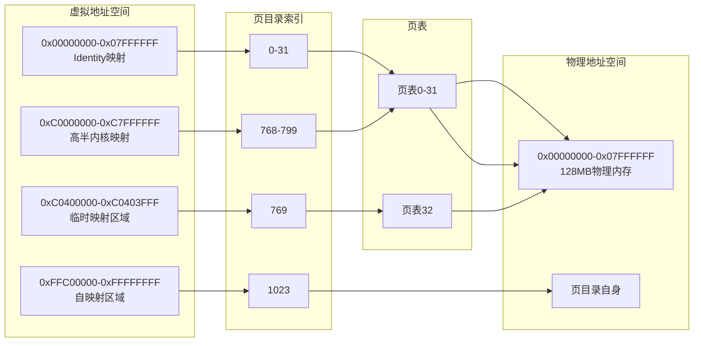
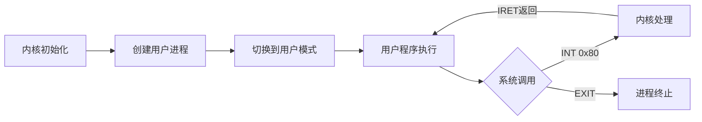

# 操作系统开发总结

## &#x20;简介

本文是编写自己的x86操作系统的实用指南。它旨在提供足够的技术细节帮助，同时不过多展示示例和代码片段。我们尝试收集了大量可用材料（通常都很优秀）和教程，无论是网上的还是其 他地方的，并加入了我们自己遇到的问题和解决方法的见解。

作者作为一名有4年经验的代码工作者，似乎之前的工作总是作流程性的编码工作，处理的业务问题多，性能少，自从学习到了GNU作者Richard Stallman的精神，我决定要总结一下自己的知识，设计一个Matrix OS，并实现它，而且能够稳定运行。本文非自己创新之作，乃看着车子作轮子的拙作，如果有朋友需要借鉴，自无不可。

操作系统是一组主管并控制计算机操作、运用和运行硬件、软件资源和提供公共服务来组织用户交互的相互关联的系统软件程序，同时也是计算机系统的内核与基石。本系统主要实现操作系统关于进程管理，内存管理，文件系统管理，输入输出管理。

## &#x20;第一步

开发操作系统（OS）并非易事，在项目过程中，不同问题可能会多次出现"我该如何开始解决这个问题？"的疑问。本章将帮助你设置开发环境，并启动一个非常小（且原始）的操作系统。

### 工具

#### 快速设置

我们（作者）使用Ubuntu作为操作系统开发环境，既在物理机上运行，也在虚拟机（使用VirtualBox）中运行。快速启动的方法是使用与我们相同的设置，因为我们知道这些工具适用于本书提供的示例。

#### 编程语言

操作系统将使用C编程语言开发，使用GCC。我们选择C是因为操作系统开发需要对生成的代码有非常精确的控制，并直接访问内存。提供相同功能的其他语言也可以使用，但本书只涵盖C。

#### 构建系统

在构建Makefile示例时使用了Make。

#### 虚拟机

在开发操作系统时，能够将代码运行在虚拟机中而不是物理计算机上非常方便，因为在虚拟机中启动操作系统比将操作系统放到物理介质上然后在物理机器上运行要快得多。Bochs是x86（IA-32）平台的模拟器， 由于其调试功能，非常适合操作系统开发。

### 安装部署

万事开头难，执着全局可能会让你无所是从，不知道从哪里下手，那我们就现在编译一个tiny os，开始这段旅程。

本文基于Ubuntu 24.04.2 LTS 去运行，基于GNU相关软件编写。

先安装如下软件，建立一个简单的ISO：

```bash
sudo apt-get install build-essential nasm genisoimage bochs bochs-sdl
```

iso结构如下

iso&#x20;

└── boot&#x20;

&#x9;		├── grub&#x20;

&#x9;		│ 		├── menu.lst&#x20;

&#x9;		│ 		└── stage2\_eltorito&#x20;

&#x9;		└── kernel.elf

使用genisoimage命令生成iso，iso文件现在包含可执行文件，grub bootloader和配置文件。使用bochs运行系统,成功！


## &#x20;进入C语言

本章将展示如何使用C语言而不是汇编代码作为操作系统的编程语言。汇编非常适合与CPU交互，并实现对代码每个方面的最大控制。然而，至少对作者来说，C语言是更方便使用的语言。 因此，我们希望在可能的情况下尽可能多地使用C语言，只在有意义的地方使用汇编代码。

### 设置栈

使用C语言的一个前提条件是栈，因为所有非平凡的C程序都使用栈。设置栈并不比使esp寄存器指向空闲内存区域的末尾更难（记住在x86上栈向低地址增长）， 并且正确对齐（从性能角度看，建议4字节对齐）。

我们可以将esp指向内存中的随机区域，因为到目前为止，内存中只有GRUB、BIOS、操作系统内核和一些内存映射的I/O。这不是一个好主意——我们不知道有多少内存可用，或者esp指向的区域是否被其他东西使用。 更好的想法是在ELF文件的.bss部分保留一块未初始化的内存。 使用.bss部分而不是.data部分更好，可以减少操作系统可执行文件的大小。 由于GRUB理解ELF，GRUB在加载操作系统时会分配.bss部分中保留的任何内存。&#x9;

    内存地址 (增长方向，高地址在上) 
    +----------------------+  <- 0x100000 + 内核总大小
    |                      |
    |         ...          |
    |                      |
    +----------------------+  <- kernel_stack + KERNEL_STACK_SIZE
    |      栈顶 (Top)       |  <- esp 初始指向这里
    + - - - - - - - - - - -+  <- 第一次 push 后的 esp
    |      已使用栈空间      |  <- 栈向下增长时，这里先被使用
    |       (高地址区域)     |     (push 操作先占用高地址)
    + - - - - - - - - - - -+
    |      未使用栈空间      |
    |       (低地址区域)     |
    +----------------------+  <- kernel_stack (栈底)
    |          |           |
    |   .bss   | (未初始化数据)|  
    |          |           |
    +----------------------+
    |          |           |
    |  .data   | (已初始化数据)|  
    |          |           |
    +----------------------+
    |          |           |
    | .rodata  | (只读数据)  |  
    |          |           |
    +----------------------+
    |          |           |
    |  .text   | (程序代码)  |  <- 0x00100000 (1 MB)
    |          |           |
    +----------------------+ 从汇编调用C代码

下一步是从汇编代码调用C函数。从汇编代码调用C代码有许多不同的约定。本书使用cdecl调用约定，因为这是GCC使用的约定。 cdecl调用约定规定函数的参数应通过栈传递（在x86上）。 函数的参数应按从右到左的顺序压入栈中，即先压入最右边的参数。函数的返回值放在eax寄存器中。

## &#x20;输出

本章将介绍如何在控制台上显示文本以及如何将数据写入串行端口。此外，我们将创建第一个驱动程序，即作为内核和硬件之间层的代码，提供比直接与硬件通信更高级的抽象。Bochs可以将串行端口的输出存储到文件中，从而为操作系统创建有效的日志记录机制。

### 与硬件交互

通常有两种不同的方式与硬件交互：内存映射I/O和I/O端口。

如果硬件使用内存映射I/O，那么你可以写入特定的内存地址，硬件将更新为新数据。这方面的一个例子是帧缓冲区，稍后将详细讨论。 例如，如果你将值0x410F写入地址0x000B8000，你将在黑色背景上看到一个白色的字母A（更多细节见帧缓冲区部分）。

如果硬件使用I/O端口，那么必须使用汇编指令out和in与硬件通信！out指令有两个参数：I/O端口的地址和要发送的数据。in指令有一个参数，即I/O端口的地址，并从硬件返回数据。 可以将I/O端口视为与硬件通信的方式，就像使用套接字与服务器通信一样。 帧缓冲区的光标（闪烁的矩形）是PC上通过I/O端口控制的硬件的一个例子。

### 帧缓冲区

帧缓冲区是一种硬件设备，能够将内存缓冲区显示在屏幕上。帧缓冲区有80列和25行，行和列索引从0开始（因此行标记为0-24）。

#### 写入文本

通过帧缓冲区向控制台写入文本是通过内存映射I/O完成的。帧缓冲区的内存映射I/O的起始地址是0x000B8000。 内存分为16位单元，其中16位确定字符、前景色和背景色。

#### 驱动程序

驱动程序应提供一个接口，以便操作系统中的其余代码可通过该接口与帧缓冲区进行交互。接口应提供什么功能并没有对错之分，但建议是提供一个具有以下声明形式的写入函数：

```c
int write(char *buf, unsigned int len);
```

### 串行端口

串行端口是一种用于硬件设备间通信的接口，尽管如今几乎所有主板都配备了该功能，但很少以DE-9连接器的形式向用户暴露。串行端口易于使用，且更重要的是，它可在Bochs中作为日志记录工具使用。若计算机支持串行端口，则通常支持多个串行端口，但我们仅会使用其中一个端口。这是因为我们仅将串行端口用于日志记录。此外，我们仅将串行端口用于输出，而非输入。串行端口完全通过I/O端口进行控制。

#### 配置串行端口

首先需要发送到串行端口的是配置数据。为了让两个硬件设备能够相互通信，它们必须在以下几个事项上达成一致：\
• 用于发送数据的速度（比特率或波特率）\
• 是否对数据使用任何错误检查（奇偶校验位、停止位）\
• 表示数据单元所需的位数（数据位）

#### 配置线路

配置线路意味着配置数据如何通过线路传输。串行端口有一个I/O端口，即线路命令端口，用于进行配置。

首先需要设置数据传输速度。串行端口有一个内部时钟，其运行频率为115200 Hz。设置速度意味着向串行端口发送一个分频器值，例如发送数值2将得到115200 / 2 = 57600 Hz的速度。

分频器是一个16位数，但我们一次只能发送8位数据。因此，我们必须先发送一个指令告诉串行端口先接收高8位，再接收低8位。这是通过向线路命令端口发送0x80来实现的。

## &#x20;分段

x86中的分段意味着通过段访问内存。段是地址空间的部分，可能重叠，由基地址和限制指定。 要在分段内存中寻址一个字节，你使用48位逻辑地址：16位指定段，32位指定该段内的偏移量。 偏移量加到段的基地址上，生成的线性地址根据段的限制进行检查。 如果一切正常（包括现在忽略的访问权限检查），结果是一个线性地址。 当分页禁用时，线性地址空间1:1映射到物理地址空间，可以访问物理内存。


### 访问内存

大多数情况下访问内存时，不需要显式指定要使用的段。处理器有六个16位段寄存器：cs、ss、ds、es、gs和fs。 寄存器cs是代码段寄存器，指定在获取指令时使用的段。 寄存器ss在访问栈时使用（通过栈指针esp），ds用于其他数据访问。 操作系统可以自由使用寄存器es、gs和fs。

### 全局描述符表（GDT）

GDT/LDT是8字节段描述符的数组。GDT中的第一个描述符始终是空描述符，永远不能用于访问内存。 GDT至少需要两个段描述符（加上空描述符），因为描述符包含的不仅仅是基地址和限制字段。 对我们来说，最相关的两个字段是类型字段和描述符特权级别（DPL）字段。

描述符特权级（DPL）规定了使用该段所需的特权级别。x86架构支持四种特权级别（PL），从0到3，其中PL0权限最高。内核应当具备完全的操作权限，因此其使用的段描述符中DPL被设置为0（也称为内核模式）。当前特权级别（CPL）由cs寄存器中的段选择子决定。

本操作系统采用平坦模型的内存环境，专注于实现分页管理，对于分段采用极简处理。这是一种简化策略，通过将所有段的基地址设置为 `0`，段界限设置为 `0xFFFFF`（4GB），并将粒度设置为 `1`（4KB页），使得所有段（代码段、数据段、堆栈段）都覆盖从 `0` 到 `4GB` 的**整个线性地址空间**。

    ; --- 新增：GDT 定义 ---
    section .data
    align 4
    ; GDT 表开始
    gdt_start:
        ; 空描述符 (索引 0)
        dq 0

    ; 代码段描述符 (索引 1, 选择子 = 0x08)
    gdt_code:
        dw 0xffff       ; 段界限 (0-15)
        dw 0x0000       ; 段基址 (0-15)
        db 0x00         ; 段基址 (16-23)
        db 10011010b    ; 类型标志: P=1, DPL=00, S=1, Type=1010 (执行/读)
        db 11001111b    ; 其他标志: G=1, D/B=1, L=0, AVL=0, 段界限 (16-19)=1111
        db 0x00         ; 段基址 (24-31)

    ; 数据段描述符 (索引 2, 选择子 = 0x10)
    gdt_data:
        dw 0xffff       ; 段界限 (0-15)
        dw 0x0000       ; 段基址 (0-15)
        db 0x00         ; 段基址 (16-23)
        db 10010010b    ; 类型标志: P=1, DPL=00, S=1, Type=0010 (读/写)
        db 11001111b    ; 其他标志: G=1, D/B=1, L=0, AVL=0, 段界限 (16-19)=1111
        db 0x00         ; 段基址 (24-31)
    gdt_end:

    ; GDT 描述符（用于 lgdt 指令）
    gdt_descriptor:
        dw gdt_end - gdt_start - 1  ; GDT 大小
        dd gdt_start                ; GDT 线性起始地址

    section .text:                  ; start of the text (code) section
    global loader
    extern kmain

    loader:                         ; the loader label (defined as entry point in linker script)

            ; --- 新增：加载 GDT ---
            cli                     ; 可选：禁用中断
            lgdt [gdt_descriptor]   ; 加载 GDT

            ; --- 新增：启用保护模式 ---
            mov eax, cr0            ; 2. 读取CR0寄存器到EAX
            or eax, 0x1             ; 设置PE（Protection Enable）位为1
            mov cr0, eax            ; 3. 写回CR0，正式启用保护模式！

            ; --- 设置代码段 (CS) ---
            jmp 0x08:flush_cs       ; 远跳转：使用选择子 0x08 (代码段) 更新 CS
    flush_cs:

            ; --- 设置数据段寄存器 ---
            mov ax, 0x10            ; 选择子 0x10 (数据段)
            mov ds, ax
            mov es, ax
            mov fs, ax
            mov gs, ax
            mov ss, ax              ; 栈段也使用数据段

## &#x20;中断和输入

现在操作系统可以产生输出，如果它也能获取一些输入就更好了。（操作系统必须能够处理中断才能从键盘读取信息）。当键盘、串行端口或计时器等硬件设备向CPU发出信号，表明设备状态已更改时，就会发生中断。 CPU本身也可以由于程序错误发送中断，例如当程序引用它无权访问的内存时，或者当程序将数字除以零时。 最后，还有软件中断，这些中断是由int汇编指令引起的，通常用于系统调用。

### 中断处理程序

通过中断描述符表（IDT）处理中断。IDT描述了每个中断的处理程序。
中断编号为0-255，中断i的处理程序定义在表中的第i个位置。中断有三种不同的处理程序：

*   任务处理程序
*   中断处理程序
*   陷阱处理程序

任务处理程序使用Intel版本的x86特有的功能。 中断处理程序和陷阱处理程序之间的唯一区别是中断处理程序禁用中断， 这意味着在处理中断时不能同时获取另一个中断。

### 处理中断

当中断发生时，CPU会将有关该中断的一些信息压入堆栈，随后在IDT中查找相应的中断处理程序并跳转至该程序。具体会在堆栈上压入错误代码的CPU中断号为8、10、11、12、13、14和17。中断处理程序可利用错误代码获取有关事件详情的更多信息。另请注意：中断号不会压入堆栈。我们只能通过正在执行的代码来判断发生了何种中断——若为中断17注册的处理程序正在执行，则说明发生了中断17。

中断处理程序完成后，通过iret指令返回。该指令要求堆栈保持与中断发生时相同的状态。因此，中断处理程序压入堆栈的所有值都必须弹出。在返回之前，iret会通过弹出堆栈值来恢复eflags，最终跳转到由堆栈值指定的cs\:eip位置。

中断处理程序必须用汇编代码编写，因为处理程序使用的所有寄存器都需通过压入堆栈来保存。这是由于被中断的代码并不知道中断的发生，因此会要求其寄存器保持原状。若完全用汇编代码编写中断处理程序的所有逻辑将非常繁琐。更好的方案是：用汇编代码编写一个保存寄存器、调用C函数、恢复寄存器最后执行iret的通用处理程序。

```
	isr_common_stub:
    pusha                    ; 保存通用寄存器
    mov ax, ds
    push eax                 ; 保存原数据段

    mov ax, 0x10
    mov ds, ax
    mov es, ax
    mov fs, ax
    mov gs, ax

    ; 此时栈布局（从低地址到高地址）：
    ;   [esp+0]:  eax_save (原 ds)
    ;   [esp+4]:  gs,fs,es,ds,edi,esi,ebp,ebx,edx,ecx,eax
    ;   [esp+36]: 0       ← 伪错误码
    ;   [esp+40]: 33      ← 中断号
    ;
    ; 我们要调用 interrupt_handler(33, &regs)

    push dword [esp + 40]  ; 第二个参数：int_no
    lea eax, [esp + 44]    ; 计算 regs 指针（跳过 int_no 和 err_code）
    push eax               ; 第一个参数：regs
    call interrupt_handler
    add esp, 8             ; 清理两个参数

    pop eax                ; 恢复原 ds
    mov ds, ax
    mov es, ax
    mov fs, ax
    mov gs, ax
    popa                   ; 恢复通用寄存器

    add esp, 8             ; 清除中断号和伪错误码

    ; 发送 EOI 到主 PIC
    mov al, 0x20
    out 0x20, al           ; EOI 命令

    sti
    iret

```

### 扩展阅读

1.  **OSDev开发者百科**

    *   《中断机制详解》\
        操作系统中断处理的完整技术解析，涵盖硬件中断到软件处理的完整链路：\
        <http://wiki.osdev.org/Interrupts>
2.  **Intel官方技术白皮书**

    *   《Intel® 64和IA-32架构开发手册卷3A第6章》\
        权威硬件中断规范，包含中断描述符表(IDT)、异常处理等核心机制（参见文献\[33]）

## &#x20;虚拟内存简介

虚拟内存是物理内存的抽象。虚拟内存的目的通常是简化应用程序开发，并让进程寻址比机器实际内存大得多的内存范围。它还意味着当进程寻址内存的一个字节时，它将使用虚拟（线性）地址而不是物理地址。 用户进程中的代码不会注意到任何差异（除了执行延迟）。 线性地址通过MMU和页表转换为物理地址。如果虚拟地址没有映射到物理地址，CPU将引发页错误中断。

分页是可选的，一些操作系统不使用它。但是如果我们想将某些内存区域标记为仅可由以特定特权级别运行的代码访问（以便能够以不同特权级别运行进程），分页是最简洁的方式。

### 通过分段实现虚拟内存？

你可以完全跳过分页，仅使用分段来实现虚拟内存。每个用户模式进程将获得自己的段，基地址和限制设置正确。这样，没有进程可以看到另一个进程的内存。 这样做的一个问题是进程的物理内存需要是连续的（或者至少如果它是连续的会非常方便）。 要么我们需要提前知道程序需要多少内存（不太可能）， 要么我们可以在限制达到时将内存段移动到可以增长的地方（昂贵，导致碎片——即使有足够的内存也可能导致"内存不足"）。 分页解决了这两个问题。

## &#x20;分页

分段将逻辑地址转换为线性地址。分页将这些线性地址转换到物理地址空间，并确定访问权限以及内存应如何缓存。

### 为什么分页？

分页是x86中最常用的技术，用于启用虚拟内存！通过分页的虚拟内存意味着每个进程将获得可用内存范围是0x00000000 - 0xFFFFFFFF的印象，即使实际内存大小可能小得多。 它还意味着当进程寻址内存的一个字节时，它将使用虚拟（线性）地址而不是物理地址。 用户进程中的代码不会注意到任何差异（除了执行延迟）。线性地址通过MMU和页表转换为物理地址。 如果虚拟地址没有映射到物理地址，CPU将引发页错误中断。

分页是可选的，一些操作系统不使用它。但是如果我们想将某些内存区域标记为仅可由以特定特权级别运行的代码访问（以便能够以不同特权级别运行进程），分页是最简洁的方式。

### x86中的分页

x86中的分页由页目录（PDT）组成，可以包含对1024个页表（PT）的引用，每个页表可以指向1024个称为页帧（PF）的物理内存部分。每个页帧大小为4096字节。 在虚拟（线性）地址中，最高10位指定当前PDT中页目录条目（PDE）的偏移量， 接下来的10位指定由该PDE指向的页表中的页表条目（PTE）的偏移量。地址中的最低12位是要寻址的页帧内的偏移量。

所有页目录、页表和页帧需要对齐到4096字节地址！这使得可以用32位地址的最高20位来寻址PDT、PT或PF，因为最低12位需要为零。

PDE和PTE结构彼此非常相似：32位（4字节），其中最高20位指向PTE或PF，最低12位控制访问权限和其他配置。4字节乘以1024等于4096字节，因此页目录和页表本身都可以放入一个页帧中。


虽然页面通常为4096字节，但也可以使用4MB大小的页面。此时，页目录项（PDE）直接指向一个4MB的页帧，该页帧必须在4MB地址边界上对齐。地址转换过程与上图几乎相同，只是省去了页表这一层。系统中可以同时混合使用4MB和4KB的页面。

指向当前页目录（PDT）的20位地址存储在寄存器 cr3 中。cr3 的低12位用于配置。

最简单的分页形式是将每个虚拟地址直接映射到相同的物理地址，这称为**恒等映射分页**（identity paging）。这种映射可以在编译时通过创建一个页目录来实现，其中每个页目录项都指向其对应的4MB物理内存区域（页帧）。在 NASM 汇编器中，可以使用宏和指令（如 `%rep`、`times` 和 `dd`）来完成这一操作。当然，也可以在运行时通过普通的汇编指令代码来实现。

### 分页与内核

\
如果将内核放置在虚拟地址空间的起始位置——即将虚拟地址范围 (0x00000000, "内核大小") 映射到内存中内核的实际位置——那么在链接用户模式进程代码时会出现问题。通常情况下，在链接过程中，链接器会假设代码将被加载到内存地址 0x00000000 处。因此，在解析绝对引用时，链接器会以 0x00000000 作为基地址来计算确切的位置。但如果内核已经占用了虚拟地址空间 (0x00000000, "内核大小") 的映射，用户模式进程就无法再加载到虚拟地址 0x00000000 处——它必须被放置在其他位置。这样一来，链接器关于用户模式进程将被加载到内存地址 0x00000000 的假设就不成立了。虽然可以通过使用链接器脚本来告诉链接器使用不同的起始地址来解决此问题，但这对于操作系统用户来说是一种非常繁琐的解决方案。

这还基于一个前提：我们希望将内核作为用户进程地址空间的一部分。正如我们稍后将看到的，这是一个很好的特性，因为在进行系统调用时，我们无需更改任何分页结构即可访问内核的代码和数据。当然，内核页面必须设置为仅允许特权级 0（即内核态）访问，以防止用户进程读取或写入内核内存。

理想情况下，内核应被放置在很高的虚拟内存地址处，例如 0xC0000000（3 GB）。用户进程几乎不可能达到 3 GB 的大小，因此这是唯一可能发生地址冲突的情况。当内核使用 3 GB 及以上地址的虚拟地址时，称之为“**高半区内核**”（higher-half kernel）。0xC0000000 只是一个示例，只要将内核放在高于 0 的任何足够高的地址，都能获得类似的优点。选择具体地址时，需考虑内核需要多少虚拟内存空间（最简单的方式是让内核虚拟地址之上的所有内存都归内核使用），以及需要为用户进程保留多少虚拟内存空间。

分页机制为虚拟内存提供了两个重要优势。第一，它实现了对内存的细粒度访问控制。你可以将页面标记为只读、可读写，或仅限特权级0（内核态）访问等。第二，它创造了内存连续的假象。用户进程和内核都可以像访问连续内存一样使用内存，并且可以在无需移动内存中现有数据的情况下扩展这片连续内存区域。我们还可以允许用户程序访问3GB以下的所有内存地址空间，但除非它们实际使用这些地址，否则我们不必为其分配实际的物理页帧。这使得进程可以将代码段放在接近 `0x00000000` 的位置，而栈则放在接近 `0xC0000000` 的位置，却仍然只需要分配两个实际的物理页面即可运行。

### 实现



**关键映射关系总结**

1.  **双重映射**：物理内存0-128MB同时映射到虚拟地址0-128MB和0xC0000000-0xC7FFFFFF
2.  **自映射**：通过巧妙的递归指向，使得虚拟地址可以直接访问页表结构
3.  **临时映射**：预留专用区域供内核临时访问物理内存
4.  **平滑过渡**：内核可以从低地址Identity映射切换到高半地址运行

## &#x20;页帧分配

使用虚拟内存时，操作系统如何知道哪些内存部分是空闲可用的？这就是页帧分配器的作用。

### 管理可用内存

#### 有多少内存？

首先我们需要知道运行操作系统的计算机上有多少可用内存。ld最简单的方法是从GRUB传递给我们的多引导结构\[19]中读取。 GRUB收集了我们需要的关于内存的信息——哪些是保留的、I/O映射的、只读的等。 我们还必须确保不将内核使用的内存部分标记为空闲（因为GRUB没有将此内存标记为保留）。 了解内核使用多少内存的一种方法是从链接脚本中导出内核二进制文件开头和结尾的标签：

#### 管理可用内存

我们如何知道哪些页帧正在使用？页帧分配器需要跟踪哪些是空闲的，哪些不是。 有几种方法可以做到这一点：位图、链表、树、伙伴系统（Linux使用）等。 有关不同算法的更多信息，请参阅OSDev上的文章。

### 具体设计

    ┌─────────────────────────────────────────────────────────────┐
    │                  Page Frame Allocation System               │
    ├─────────────────┬─────────────────┬─────────────────────────┤
    │   Buddy 分配器   │   临时映射框架   │     内核堆分配器        │
    │   (物理内存管理)  │  (虚拟内存访问)  │    (内核动态内存)       │
    └─────────────────┴─────────────────┴─────────────────────────┘
    Buddy 分配器 (物理内存管理)
    核心机制：
    伙伴算法：将内存按2的幂次方大小分割和合并
    阶数管理：0阶=4KB, 1阶=8KB, ..., 11阶=8MB
    位图跟踪：使用位图标记页帧使用状态
    链表管理：每个阶数维护空闲块链表

    临时映射框架 (虚拟内存访问)
    核心机制：
    解决循环依赖：访问未映射的物理页帧
    多槽映射：支持多个同时的临时映射
    引用计数：安全的多重映射管理
    TLB管理：正确的缓存刷新

    内核堆分配器 (动态内存管理)
    核心机制：
    最佳适应算法：减少内存碎片
    块分裂合并：动态调整内存块大小
    对齐管理：8字节对齐保证访问效率
    统计跟踪：内存使用情况监控

    调用关系：
    ┌─────────────────┐    ┌─────────────────┐    ┌─────────────────┐
    │   应用程序代码    │    │   内核堆分配器    │    │   Buddy 分配器   │
    │                 │    │                 │    │                 │
    │ kmalloc(100) ───┼───►│ 查找空闲块      │    │                 │
    │                 │    │ 或扩展堆 ───────┼───►│ pmm_alloc_pages │
    │ kfree(ptr) ─────┼───►│ 标记空闲并合并  │    │                 │
    │                 │    │                 │    │                 │
    └─────────────────┘    └─────────────────┘    └─────────┬───────┘
                                                            │
    ┌─────────────────┐    ┌─────────────────┐              │
    │   页表管理代码    │    │   临时映射框架    │              │
    │                 │    │                 │              │
    │ 创建新页表 ──────┼───►│ temp_map_page  │◄─────────────┘
    │                 │    │                 │
    │ 访问物理内存 ────┼───►│ 映射到0xC03FF000│
    │                 │    │ 访问后取消映射  │
    └─────────────────┘    └─────────────────┘

#### 关键特性总结

1.  **分层设计**：物理层(Buddy) → 映射层(临时映射) → 应用层(堆分配)
2.  **解耦依赖**：临时映射打破"需要页表来访问页表"的循环
3.  **效率优化**：Buddy减少碎片，最佳适应提高堆利用率
4.  **安全保证**：自旋锁保护并发访问，引用计数防止错误取消映射
5.  **可调试性**：详细统计信息和错误检测

## &#x20;用户模式

用户模式现在几乎触手可及，只需几步即可实现。尽管这些步骤在本章中看起来很简单，但实现起来可能很棘手，因为有很多地方的小错误会导致难以发现的错误。

### 用户模式的段

要启用用户模式，我们需要向GDT添加两个更多的段。它们与我们设置分段时添加到GDT的内核段非常相似：

| 索引 | 偏移量  | 名称    | 地址范围                    | 类型 | DPL |
| -- | ---- | ----- | ----------------------- | -- | --- |
| 3  | 0x18 | 用户代码段 | 0x00000000 - 0xFFFFFFFF | RX | PL3 |
| 4  | 0x20 | 用户数据段 | 0x00000000 - 0xFFFFFFFF | RW | PL3 |

不同之处在于DPL，现在允许代码在PL3执行。段仍然可以用于寻址整个地址空间，仅为用户模式代码使用这些段不会保护内核。为此我们需要分页。

### 为用户模式设置

每个用户模式进程都需要一些东西：

*   用于代码、数据和栈的页帧。目前，为栈分配一个页帧并为程序的代码分配足够的页帧就足够了。
    此时不必担心设置可以增长和缩小的栈，首先专注于使基本实现工作。

*   GRUB模块中的二进制文件必须复制到用于程序代码的页帧中。

*   需要页目录和页表来将上述页帧映射到内存中。
    至少需要两个页表，因为代码和数据应映射到0x00000000并递增，
    而栈应正好从内核下方开始，在0xBFFFFFFB，向低地址增长。必须设置U/S标志以允许PL3访问。

将这些信息存储在表示进程的结构中可能很方便。这个进程结构可以用内核的malloc函数动态分配。

### 进入用户模式

执行比当前特权级（CPL）更低特权级代码的唯一方法，是分别通过执行 `iret` 或 `lret` 指令——即中断返回或长返回。

为进入用户模式，我们需要模拟处理器触发跨特权级中断时的堆栈结构。堆栈应按以下方式组织：

    [esp + 16] ss   ; 用户模式所需的堆栈段选择子
    [esp + 12] esp  ; 用户模式堆栈指针
    [esp + 8]  eflags ; 要在用户模式使用的控制标志
    [esp + 4]  cs   ; 代码段选择子
    [esp + 0]  eip  ; 要执行的用户模式代码指令指针

随后，`iret` 指令将从堆栈中读取这些值并填充到相应寄存器中。在执行 `iret` 前，我们需要切换到为用户模式进程设置的页目录。必须注意：在切换页目录后，为继续执行内核代码，内核仍需保持映射。实现方法之一是为内核单独设置页目录（映射 `0xC0000000` 及以上的所有数据），在执行切换时将其与用户页目录（仅映射 `0xC0000000` 以下地址）合并。请注意，设置 cr3 寄存器时必须使用页目录的物理地址。

eflags 寄存器包含一组不同的标志位。对我们而言最重要的是中断允许（IF）标志。在特权级3下无法使用汇编指令 `sti` 开启中断。如果在进入用户模式时中断被禁用，则进入用户模式后将无法重新启用中断。通过设置堆栈上 eflags 条目中的 IF 标志，将在用户模式中启用中断，因为 `iret` 指令会把堆栈中的对应值载入 eflags 寄存器。

目前我们应保持禁用中断，因为要使跨特权级中断正常工作还需更多准备工作。

堆栈上的 cs 和 ss 值应分别为用户代码段和用户数据段的段选择子。如分段章节所述，段选择子的最低两位是 RPL（请求特权级）。当使用 `iret` 进入 PL3 时，cs 和 ss 的 RPL 应为 0x3。寄存器 ds 及其他数据段寄存器应设置为与 ss 相同的段选择子，可通过常规的 mov 汇编指令进行设置。

至此我们已准备就绪可执行 `iret`。若所有设置均正确无误，现在应能实现进入用户模式的内核。




#### 内存映射关系

    用户虚拟空间布局:
    0x00000000 - 0x00000FFF: 用户代码 (映射到物理页)
    0xBFFFF000 - 0xBFFFFFFF: 用户栈 (向下增长)
    0xC0000000 - 0xFFFFFFFF: 内核空间 (共享只读)

    内核虚拟空间布局:  
    0xC0000000 - 0xC07FFFFF: 内核代码/数据
    0xC0800000 - ...:        内核堆、设备映射等

## 文件系统

我们不需要在操作系统中支持文件系统，但它是一个非常可用的抽象，并且通常在许多操作系统中扮演核心角色，尤其是类UNIX操作系统。在开始支持多进程和系统调用的过程之前，我们可能需要考虑实现一个简单的文件系统。

### 为什么需要文件系统？

如何指定在我们的操作系统中运行哪些程序？第一个要运行的程序是哪个？程序如何输出数据或读取输入？

在类UNIX系统中，遵循几乎一切都是文件的惯例，这些问题通过文件系统解决。（了解Plan 9项目也可能很有趣，它将这个想法更进一步。）

### 简单的只读文件系统

最简单的文件系统可能就是我们已有的——一个仅存在于RAM中的文件，由GRUB在内核启动前加载。当内核和操作系统增长时，这可能太有限了。

比仅一个文件的位稍微高级的文件系统是带有元数据的文件。元数据可以描述文件的类型、文件的大小等。可以创建一个在构建时运行的实用程序，将此元数据添加到文件中。 这样，通过将几个带有元数据的文件连接成一个大文件，可以构建一个"文件中的文件系统"。 这种技术的结果是一个存在于内存中的只读文件系统（一旦GRUB加载了文件）。

构建文件系统的程序可以遍历主机系统上的一个目录，并将所有子目录和文件作为目标文件系统的一部分添加进去。文件系统中的每个对象（目录或文件）可以由一个头部和一个主体组成，其中文件的主体是实际的文件内容，而目录的主体则是一个条目列表——即其他文件和目录的名称和"地址"。

这种文件系统中的每个对象都是连续的，因此内核从内存中读取它们会很容易。所有对象也将具有固定的大小（除了最后一个可以增长的对象），因此很难添加新文件或修改现有文件。

### 虚拟文件系统

应该使用什么样的抽象来对设备（如屏幕和键盘）进行读写操作？

虚拟文件系统在具体文件系统之上创建了一个抽象层。VFS 主要提供路径系统和文件层次结构，它将针对文件的操作委托给底层的文件系统来处理。关于 VFS 的原始论文简洁明了，非常值得一读。

通过 VFS，我们可以在路径 `/dev` 上挂载一个特殊的文件系统。该文件系统将处理所有设备，如键盘和控制台。然而，也可以采用传统的 UNIX 方法，即使用主/次设备号和 `mknod` 命令来为设备创建设备特殊文件。您认为哪种方法最合适取决于您自己，在构建抽象层时没有绝对的对错（尽管某些抽象最终会比其他的有用得多）。

## &#x20;系统调用

系统调用是用户模式应用程序与内核交互的方式——请求资源、请求执行操作等。系统调用API是内核中最暴露给用户的部分，因此其设计需要一些思考。

### 设计系统调用

作为内核开发者，我们需要设计应用程序开发者可以使用的系统调用。我们可以从POSIX标准中汲取灵感，或者如果看起来工作量太大，只需查看Linux的系统调用，并进行选择和挑选。

### 实现系统调用

系统调用传统上通过软件中断调用。用户应用程序将适当的值放入寄存器或栈中，然后启动预定义的中断，将执行转移到内核。使用的中断号取决于内核，Linux使用数字0x80来标识中断是系统调用。

执行系统调用时，当前特权级别通常从PL3更改为PL0（如果应用程序在用户模式下运行）。要允许这一点，系统调用中断的IDT条目中的DPL需要允许PL3访问。

每当发生跨特权级别中断时，处理器会将一些重要的寄存器推送到栈上——与我们之前进入用户模式时使用的寄存器相同。使用什么栈？\[33]中的同一节规定，如果中断导致代码在数值较低的特权级别执行，则会发生栈切换。寄存器ss和esp的新值从当前任务状态段（TSS）加载。TSS结构在Intel手册\[33]中指定。

要启用系统调用，我们需要在进入用户模式之前设置TSS。可以通过设置表示TSS的"打包结构"的ss0和esp0字段在C中完成设置。在将"打包结构"加载到处理器之前，必须向GDT添加TSS描述符。

## &#x20;多任务处理

如何使多个进程看起来同时运行？今天，这个问题有两个答案：

*   随着多核处理器的可用性，或在具有多个处理器的系统上，两个进程可以通过在不同核心或处理器上运行两个进程实际同时运行。

*   假装。也就是说，在进程之间快速切换（比人类能注意到的更快）。在任何给定时刻只有一个进程在执行，但快速切换给人一种它们"同时"运行的印象。

由于本书创建的操作系统不支持多核处理器或多个处理器，唯一的选择是假装。负责在进程之间快速切换的操作系统部分称为调度算法。

### 创建新进程

通常使用两个不同的系统调用创建新进程：fork和exec。fork创建当前运行进程的精确副本，而exec用文件系统中程序路径指定的进程替换当前进程。这两个中我们建议你开始实现exec，因为这个系统调用将执行与"用户模式"一章中"为用户模式设置"部分描述的几乎完全相同的步骤。

#### 通过让出实现协作调度

实现进程之间快速切换的最简单方法是让进程本身负责切换。进程运行一段时间，然后告诉操作系统（通过系统调用）现在可以切换到另一个进程。将CPU控制权交给另一个进程称为让出，当进程本身负责调度时，称为协作调度，因为所有进程必须相互协作。

当进程让出时，进程的整个状态必须保存（所有寄存器），最好在内核堆上的表示进程的结构中。当切换到新进程时，所有寄存器必须从保存的值中恢复。
